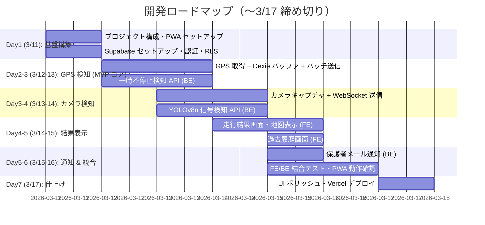

# 青切符ドライブ 具体的設計案

## 1. アプリ概要

自転車走行中に **GPS** と **カメラ映像** をリアルタイムで取得し、
「信号無視」「一時不停止」を自動検知して走行ログと違反情報を保存・表示する **PWA（Progressive Web App）**。

スマートフォンのブラウザ上で動作し、ホーム画面に追加することでネイティブアプリに近い体験を提供する。

---

## 2. 技術スタック選定

### フロントエンド（PWA）

| 項目 | 選定技術 | 理由 |
|------|----------|------|
| フレームワーク | **React 19 + Vite 7** | 高速 HMR・バンドル最適化 |
| PWA | **vite-plugin-pwa**（`injectManifest` モード） | SW カスタム制御が必要（オフラインバッファ・Wake Lock 連携） |
| カメラ | `MediaDevices.getUserMedia()` + **Canvas toBlob** | フレーム単位の JPEG 送信に最適。追加ライブラリ不要 |
| GPS | `navigator.geolocation.watchPosition()` | リアルタイム位置追跡。画面ON維持が前提 |
| 画面スリープ防止 | **Screen Wake Lock API** | 走行中の画面OFF防止（対応率 94.6%） |
| 地図表示 | **Leaflet.js** (`react-leaflet`) | OSS・軽量、OSM タイルを無料利用可 |
| 通信（HTTP） | **TanStack Query** + `fetch` | サーバー状態管理・キャッシュ・再試行を統合。axios は不要 |
| 通信（リアルタイム） | **reconnecting-websocket** | 自動再接続（指数バックオフ+ジッター）付き WebSocket |
| 状態管理（クライアント） | **Zustand** | GPS 追跡状態・WS 接続状態・UI 状態など |
| 状態管理（サーバー） | **TanStack Query** | API レスポンスのキャッシュ・同期・楽観的更新 |
| オフラインストレージ | **Dexie.js**（IndexedDB ラッパー） | GPS ポイントのローカルバッファリング・オフライン対応 |
| UI コンポーネント | **Tailwind CSS** + **shadcn/ui** | モバイルファーストの迅速な UI 構築 |
| ルーティング | **React Router v7** | SPA ルーティング |

> [!WARNING]
> **ブラウザ制約（PWA の限界）**
> - GPS・カメラは **HTTPS 必須**（localhost は例外）
> - **バックグラウンド GPS 取得は不可能**：ブラウザの Geolocation API は Service Worker に公開されていない（W3C Issue #745）。走行中は Wake Lock API で画面 ON を維持する設計が必須
> - iOS Safari は SW がバックグラウンドで即座にフリーズ。Background Sync も非対応
> - iOS の PWA キャッシュ上限は約 50MB。大量の画像はサーバーに即時アップロードする設計にする

### 状態管理の設計方針

```
┌─────────────────────────────────────────────────────┐
│  React コンポーネント                                │
│                                                     │
│  ┌─────────────┐  ┌──────────────────────────────┐  │
│  │  Zustand     │  │  TanStack Query              │  │
│  │  (クライアント│  │  (サーバー状態)               │  │
│  │   状態)      │  │                              │  │
│  │  - GPS ON/OFF│  │  - trips 一覧取得             │  │
│  │  - WS 接続   │  │  - violations 取得            │  │
│  │  - 現在の     │  │  - trip 開始/終了             │  │
│  │    走行情報   │  │  - キャッシュ自動管理         │  │
│  └──────┬──────┘  └──────────────┬───────────────┘  │
│         │                        │                  │
│  ┌──────▼──────┐          ┌──────▼───────────────┐  │
│  │  Dexie.js   │          │  Supabase Client      │  │
│  │  (IndexedDB) │          │  (REST / Realtime)    │  │
│  │  GPS バッファ│          │                       │  │
│  └─────────────┘          └───────────────────────┘  │
└─────────────────────────────────────────────────────┘
```

**アンチパターンの回避：**
- Context API は認証ユーザー・テーマなど**低頻度更新の値のみ**に使用。高頻度データ（GPS 座標等）を Context に入れると全消費コンポーネントが再レンダーされる
- `useState` で済む局所状態は Zustand に入れない。グローバルに共有が必要な状態のみ Zustand を使用
- API データは TanStack Query に一任し、Zustand と二重管理しない

---

### バックエンド

単一 FastAPI アプリケーション内でルーターを分離する構成とする（ハッカソン規模ではマイクロサービス分割はオーバーエンジニアリング）。

| 項目 | 選定技術 | 理由 |
|------|----------|------|
| フレームワーク | **FastAPI** | 非同期処理・WebSocket・自動 OpenAPI スキーマ生成 |
| パッケージ管理 | **uv** | pip より高速。ロックファイルで再現性担保 |
| WebSocket 管理 | **ConnectionManager パターン** | 接続登録/解除・ルーム管理・ハートビート |
| 画像解析 | **YOLOv8n** (Ultralytics) | 軽量モデルで信号機・一時停止標識の物体検出 |
| 信号色判定 | **OpenCV** | 検出した信号機 ROI の HSV 色空間解析 |
| 地図データ | **OpenStreetMap + Overpass API** | 一時停止標識の位置情報取得 |
| 位置照合 | **Shapely / geopy** | GPS 座標と停止線座標の距離計算 |
| バリデーション | **Pydantic v2** | FastAPI 統合。リクエスト/レスポンスの型安全性 |

#### バックエンドディレクトリ構成

```
backend/
├── app/
│   ├── main.py               # FastAPI アプリケーション・ライフサイクル
│   ├── config.py              # 環境変数・設定
│   ├── routers/
│   │   ├── trips.py           # 走行セッション CRUD
│   │   ├── gps.py             # GPS 解析エンドポイント
│   │   └── camera.py          # カメラ WebSocket エンドポイント
│   ├── services/
│   │   ├── gps_analysis.py    # 一時不停止判定ロジック
│   │   ├── camera_analysis.py # 信号検出ロジック
│   │   └── notification.py    # 保護者通知
│   ├── models/
│   │   └── schemas.py         # Pydantic スキーマ
│   └── websockets/
│       └── manager.py         # ConnectionManager
├── pyproject.toml
├── uv.lock
└── Dockerfile
```

#### WebSocket 接続管理パターン

```python
class ConnectionManager:
    """WebSocket 接続のライフサイクル管理"""

    def __init__(self):
        self.active: dict[str, WebSocket] = {}  # trip_id -> ws

    async def connect(self, trip_id: str, ws: WebSocket):
        await ws.accept()
        self.active[trip_id] = ws

    def disconnect(self, trip_id: str):
        self.active.pop(trip_id, None)

    async def send_event(self, trip_id: str, data: dict):
        if ws := self.active.get(trip_id):
            await ws.send_json(data)
```

**ハートビート**: サーバーから 30 秒間隔で ping 送信。5 秒以内に pong がなければ接続クローズ & クリーンアップ。

**バックプレッシャー**: `asyncio.Queue(maxsize=100)` で接続ごとにキューを設け、クライアントの送信速度が処理速度を超えた場合に古いフレームを破棄。

---

### データベース

| 項目 | 選定技術 | 理由 |
|------|----------|------|
| DB | **Supabase** (PostgreSQL) | BaaS で認証・ストレージ・RLS が一体 |
| ファイルストレージ | **Supabase Storage** | 違反箇所の静止画を保存 |
| クライアントローカル | **IndexedDB (Dexie.js)** | GPS ポイントのオフラインバッファ |

---

### インフラ

| 項目 | 選定技術 | 理由 |
|------|----------|------|
| バックエンドホスティング | **Railway** または **Render** | Docker デプロイ可能、無料枠あり |
| コンテナ | **Docker + Docker Compose** | ローカル開発環境の再現性担保 |
| フロントエンドホスティング | **Vercel** | Vite ビルド → 静的ホスティング、HTTPS 自動付与 |

> [!NOTE]
> 旧設計の Expo / React Native は不採用。PWA として Web ブラウザ上で動作させることで、
> アプリストア審査不要・即デプロイ・URL 共有可能というメリットを優先する。

---

## 3. システムアーキテクチャ

```
┌──────────────────────────────────────────────────────────┐
│  スマートフォン (PWA / React + Vite)                      │
│                                                          │
│  ┌────────────────┐  ┌──────────────┐  ┌──────────────┐ │
│  │ カメラキャプチャ │  │ GPS トラッカー │  │ Wake Lock    │ │
│  │ Canvas+toBlob  │  │ watchPosition│  │ 画面ON維持    │ │
│  └───────┬────────┘  └──────┬───────┘  └──────────────┘ │
│          │                  │                            │
│  ┌───────▼────────┐  ┌──────▼───────┐                   │
│  │ WebSocket      │  │ Dexie.js     │                   │
│  │ (reconnecting) │  │ (IndexedDB)  │                   │
│  │ JPEG フレーム   │  │ GPS バッファ  │                   │
│  └───────┬────────┘  └──────┬───────┘                   │
└──────────┼──────────────────┼────────────────────────────┘
           │                  │
           │ WebSocket        │ HTTP POST (バッチ送信)
           │                  │
┌──────────▼──────────────────▼────────────────────────────┐
│  FastAPI サーバー (単一アプリ / ルーター分離)               │
│                                                          │
│  ┌─────────────────┐    ┌──────────────────┐             │
│  │ /ws/camera       │    │ /api/gps          │             │
│  │ YOLOv8n+OpenCV  │    │ OSM+Shapely       │             │
│  │ 信号無視検知     │    │ 一時不停止検知     │             │
│  └────────┬────────┘    └────────┬─────────┘             │
│           │                      │                       │
│           └──────────┬───────────┘                       │
│                      ▼                                   │
│              Supabase Client                             │
│              (violations 書込・Storage アップロード)        │
└──────────────────────┬───────────────────────────────────┘
                       │
                       ▼
┌──────────────────────────────────────────────────────────┐
│  Supabase                                                │
│  ┌──────────┐  ┌──────────┐  ┌──────────────────┐       │
│  │ Auth     │  │ PostgreSQL│  │ Storage          │       │
│  │ 認証     │  │ DB       │  │ 違反写真         │       │
│  └──────────┘  └──────────┘  └──────────────────┘       │
│  ┌──────────────────────────────────────────────┐       │
│  │ Edge Functions (Deno)                         │       │
│  │ 保護者メール通知 (Resend API)                  │       │
│  └──────────────────────────────────────────────┘       │
└──────────────────────────────────────────────────────────┘
```

---

## 4. データモデル（Supabase テーブル設計）

### `profiles`（Supabase Auth と紐付くプロフィール拡張）

```sql
CREATE TABLE profiles (
  id          uuid PRIMARY KEY REFERENCES auth.users(id) ON DELETE CASCADE,
  username    text NOT NULL,
  parent_email text,             -- 通知送信先の保護者メール
  created_at  timestamptz DEFAULT now()
);

-- RLS: 自分のプロフィールのみ読み書き可
ALTER TABLE profiles ENABLE ROW LEVEL SECURITY;
CREATE POLICY "select_own" ON profiles FOR SELECT USING (auth.uid() = id);
CREATE POLICY "update_own" ON profiles FOR UPDATE USING (auth.uid() = id);
```

### `trips`（走行セッション）

```sql
CREATE TABLE trips (
  id          uuid PRIMARY KEY DEFAULT gen_random_uuid(),
  user_id     uuid NOT NULL REFERENCES profiles(id) ON DELETE CASCADE,
  started_at  timestamptz NOT NULL DEFAULT now(),
  ended_at    timestamptz,
  distance_m  float8,            -- 総走行距離（メートル）
  created_at  timestamptz DEFAULT now()
);

CREATE INDEX idx_trips_user_id ON trips(user_id);

ALTER TABLE trips ENABLE ROW LEVEL SECURITY;
CREATE POLICY "select_own" ON trips FOR SELECT USING (auth.uid() = user_id);
CREATE POLICY "insert_own" ON trips FOR INSERT WITH CHECK (auth.uid() = user_id);
CREATE POLICY "update_own" ON trips FOR UPDATE USING (auth.uid() = user_id);
```

### `gps_points`（GPS ポイント — route を JSONB から正規化）

```sql
CREATE TABLE gps_points (
  id          uuid PRIMARY KEY DEFAULT gen_random_uuid(),
  trip_id     uuid NOT NULL REFERENCES trips(id) ON DELETE CASCADE,
  lat         float8 NOT NULL,
  lng         float8 NOT NULL,
  speed_kmh   float8,
  accuracy_m  float8,            -- GPS 精度（メートル）
  recorded_at timestamptz NOT NULL
);

CREATE INDEX idx_gps_points_trip_id ON gps_points(trip_id);
CREATE INDEX idx_gps_points_recorded_at ON gps_points(trip_id, recorded_at);

ALTER TABLE gps_points ENABLE ROW LEVEL SECURITY;
CREATE POLICY "select_via_trip" ON gps_points FOR SELECT
  USING (EXISTS (SELECT 1 FROM trips WHERE trips.id = gps_points.trip_id AND trips.user_id = auth.uid()));
CREATE POLICY "insert_via_trip" ON gps_points FOR INSERT
  WITH CHECK (EXISTS (SELECT 1 FROM trips WHERE trips.id = gps_points.trip_id AND trips.user_id = auth.uid()));
```

> [!NOTE]
> **旧設計からの変更**: `trips.route` (JSONB 配列) を `gps_points` テーブルに正規化。
> - JSONB 配列は数千件のポイントで肥大化し、部分更新・クエリが非効率
> - 正規化により時間範囲クエリ・集計が容易。RLS もテーブル単位で適用可能

### `violations`（違反記録）

```sql
CREATE TABLE violations (
  id            uuid PRIMARY KEY DEFAULT gen_random_uuid(),
  trip_id       uuid NOT NULL REFERENCES trips(id) ON DELETE CASCADE,
  type          text NOT NULL CHECK (type IN ('signal_ignore', 'no_stop')),
  detected_at   timestamptz NOT NULL,
  lat           float8 NOT NULL,
  lng           float8 NOT NULL,
  photo_url     text,            -- Supabase Storage の URL（カメラ検知時のみ）
  created_at    timestamptz DEFAULT now()
);

CREATE INDEX idx_violations_trip_id ON violations(trip_id);

ALTER TABLE violations ENABLE ROW LEVEL SECURITY;
CREATE POLICY "select_via_trip" ON violations FOR SELECT
  USING (EXISTS (SELECT 1 FROM trips WHERE trips.id = violations.trip_id AND trips.user_id = auth.uid()));
```

---

## 5. PWA 設計

### Web App Manifest

```json
{
  "name": "青切符ドライブ",
  "short_name": "青切符",
  "description": "自転車走行の違反検知アプリ",
  "start_url": "/",
  "display": "standalone",
  "orientation": "portrait",
  "background_color": "#ffffff",
  "theme_color": "#2563eb",
  "icons": [
    { "src": "/icons/icon-192.png", "sizes": "192x192", "type": "image/png" },
    { "src": "/icons/icon-512.png", "sizes": "512x512", "type": "image/png" }
  ]
}
```

### Service Worker 戦略（injectManifest モード）

| リソース種別 | キャッシュ戦略 | 理由 |
|-------------|--------------|------|
| 静的アセット (JS/CSS/HTML) | **Precache** | ビルド時にハッシュ付きで事前キャッシュ |
| OSM タイル画像 | **StaleWhileRevalidate** + 有効期限 7 日 | オフラインでも地図表示可能にする |
| API レスポンス (/api/*) | **NetworkFirst** + タイムアウト 3 秒 | オフライン時はキャッシュから提供 |
| 画像 (違反写真等) | **CacheFirst** + 有効期限 30 日 | 一度取得した違反写真は変わらない |

### オフライン GPS バッファリング

```typescript
// Dexie.js スキーマ
const db = new Dexie('BlueTicketDriving');
db.version(1).stores({
  gpsBuffer: '++id, tripId, synced',  // オフラインバッファ
  pendingSync: '++id, type'            // 未同期リクエストキュー
});

// GPS ポイントは常にローカルに書き込み → 定期的にサーバーへバッチ送信
async function onGpsUpdate(tripId: string, coords: GeolocationCoordinates) {
  await db.gpsBuffer.add({
    tripId,
    lat: coords.latitude,
    lng: coords.longitude,
    speedKmh: (coords.speed ?? 0) * 3.6,  // m/s → km/h
    accuracyM: coords.accuracy,
    recordedAt: new Date().toISOString(),
    synced: false
  });
}

// 5 秒ごとに未同期ポイントをバッチ送信
async function syncGpsPoints(tripId: string) {
  const unsyncedPoints = await db.gpsBuffer
    .where({ tripId, synced: false })
    .toArray();

  if (unsyncedPoints.length === 0) return;

  const res = await fetch('/api/gps', {
    method: 'POST',
    body: JSON.stringify({ trip_id: tripId, points: unsyncedPoints })
  });

  if (res.ok) {
    await db.gpsBuffer
      .where('id').anyOf(unsyncedPoints.map(p => p.id!))
      .modify({ synced: true });
  }
}
```

### Wake Lock 管理

```typescript
let wakeLock: WakeLockSentinel | null = null;

async function requestWakeLock() {
  if ('wakeLock' in navigator) {
    wakeLock = await navigator.wakeLock.request('screen');
    // visibilitychange で再取得（タブ復帰時に自動解除されるため）
    document.addEventListener('visibilitychange', async () => {
      if (document.visibilityState === 'visible' && !wakeLock) {
        wakeLock = await navigator.wakeLock.request('screen');
      }
    });
  }
}

function releaseWakeLock() {
  wakeLock?.release();
  wakeLock = null;
}
```

---

## 6. 違反検知ロジック詳細

### 6-1. 信号無視（カメラ解析）

```
1. フロントエンドが Canvas + toBlob で 480p JPEG を 2-5 fps でキャプチャ
2. reconnecting-websocket で WebSocket 経由でサーバーへ送信
3. サーバー側で YOLOv8n が信号機を検出
4. 検出した信号機の ROI を OpenCV で HSV 解析 → 赤信号判定
5. 赤信号検出中に GPS 速度が閾値（5 km/h）以上 → 「信号無視」と判定
6. そのフレームを JPEG として Supabase Storage に保存
7. violations テーブルに書き込み → クライアントにイベント返送
```

**バッテリー最適化**:
- カメラ解像度は 480p（640x480）に制限。1080p は不要
- フレームレートは 2-5 fps。解析に十分かつバッテリー消費を抑制
- `track.stop()` を走行終了時に必ず呼び出し、カメラハードウェアを解放

### 6-2. 一時不停止（GPS 解析）

```
1. フロントエンドが watchPosition() で GPS 座標を取得 → Dexie.js に即時保存
2. 5 秒ごとに未同期ポイントをバッチで HTTP POST 送信
3. サーバーが現在地周辺の OSM 一時停止標識ノードを Overpass API で取得（キャッシュ付き）
4. 停止線から 10m 以内を通過した際に速度を確認
5. 通過中に速度が閾値（3 km/h）以下になった瞬間がなければ「一時不停止」と判定
6. violations テーブルに書き込み
```

**GPS 精度対策**:
- `coords.accuracy` が 20m 以上のポイントはフィルタリング（低精度データ除外）
- 停止判定半径は旧設計の 5m → **10m** に拡大（スマートフォン GPS の誤差 3-10m を考慮）
- 速度は `coords.speed`（端末算出）を優先。null の場合は連続 2 点間の距離/時間差で算出

---

## 7. API 設計

### カメラ解析（WebSocket）

```
WS /ws/camera?trip_id=yyy
Authorization: Bearer <supabase_access_token>

Client → Server: バイナリフレーム (JPEG, 480p, 2-5 fps)
Server → Client: JSON
{
  "type": "violation" | "detection" | "pong",
  "data": {
    "violation_type": "signal_ignore",
    "lat": 35.123,
    "lng": 135.456,
    "photo_url": "https://...",
    "detected_at": "2026-03-15T10:30:00Z"
  }
}
```

**接続フロー**:
1. クライアントが JWT を query param で送信して接続
2. サーバーが JWT を検証 → 無効なら即 close (4001)
3. 接続確立後、30 秒間隔でサーバーから `{"type": "ping"}` を送信
4. クライアントは `{"type": "pong"}` で応答。5 秒以内に応答がなければサーバーが切断

### GPS 解析（HTTP）

```
POST /api/gps
Authorization: Bearer <supabase_access_token>
Content-Type: application/json

{
  "trip_id": "uuid",
  "points": [
    {
      "lat": 35.123,
      "lng": 135.456,
      "speed_kmh": 12.3,
      "accuracy_m": 5.2,
      "recorded_at": "2026-03-15T10:30:00Z"
    }
  ]
}

→ 200 OK
{
  "saved": 5,
  "violations": [
    {
      "type": "no_stop",
      "lat": 35.120,
      "lng": 135.450,
      "detected_at": "2026-03-15T10:30:05Z"
    }
  ]
}
```

### 走行セッション（HTTP）

```
POST   /api/trips              → 走行開始（trip 作成、Wake Lock 開始のトリガー）
PATCH  /api/trips/:id/end      → 走行終了（ended_at 更新、通知トリガー）
GET    /api/trips/:id          → 走行結果取得（violations・gps_points 含む）
GET    /api/trips              → 過去走行一覧（ページネーション付き）
```

---

## 8. フロントエンドディレクトリ構成

```
frontend/
├── public/
│   ├── icons/                  # PWA アイコン (192x192, 512x512)
│   └── manifest.webmanifest
├── src/
│   ├── main.tsx                # エントリーポイント
│   ├── App.tsx                 # ルーティング設定
│   ├── pages/                  # ページコンポーネント
│   │   ├── LoginPage.tsx
│   │   ├── HomePage.tsx
│   │   ├── RidingPage.tsx      # 走行中画面（カメラ + GPS + Wake Lock）
│   │   ├── ResultPage.tsx      # 走行結果（地図 + 違反一覧）
│   │   ├── HistoryPage.tsx     # 過去履歴一覧
│   │   └── SettingsPage.tsx    # 保護者メール設定等
│   ├── components/             # 共通 UI コンポーネント
│   │   ├── Map.tsx             # Leaflet 地図
│   │   ├── CameraView.tsx      # カメラプレビュー + キャプチャ
│   │   └── ViolationCard.tsx   # 違反表示カード
│   ├── hooks/                  # カスタムフック
│   │   ├── useGpsTracker.ts    # GPS 追跡 + Dexie 書込 + バッチ送信
│   │   ├── useCameraStream.ts  # カメラ取得 + Canvas + WS 送信
│   │   ├── useWakeLock.ts      # Wake Lock 管理
│   │   └── useWebSocket.ts     # reconnecting-websocket ラッパー
│   ├── stores/                 # Zustand ストア
│   │   └── rideStore.ts        # 走行状態管理
│   ├── lib/                    # ユーティリティ
│   │   ├── supabase.ts         # Supabase クライアント初期化
│   │   ├── db.ts               # Dexie.js スキーマ定義
│   │   └── api.ts              # API ヘルパー（TanStack Query のクエリキー等）
│   └── sw.ts                   # Service Worker（injectManifest 用）
├── index.html
├── package.json
├── vite.config.ts
├── tailwind.config.ts
└── tsconfig.json
```

---

## 9. 画面設計（主要画面）

| 画面 | 内容 | 備考 |
|------|------|------|
| ログイン / サインアップ | Supabase Auth（メールまたは Google OAuth） | モバイルキーボード最適化 |
| ホーム | 走行開始ボタン（大きなCTA）、直近の走行サマリー | モバイルファースト |
| **走行中** | カメラビュー（背景）+ GPS 状態・違反数オーバーレイ | Wake Lock ON、画面常時点灯 |
| 走行結果 | 違反件数、地図上の違反箇所マーカー、違反写真 | react-leaflet |
| 過去履歴 | リスト形式で過去走行一覧 | 無限スクロール |
| 設定 | 保護者メール設定、プロフィール | |

### 走行中画面の状態遷移

```
[走行開始ボタン押下]
    │
    ├─ Wake Lock 取得
    ├─ GPS watchPosition 開始
    ├─ カメラ getUserMedia 開始
    ├─ WebSocket 接続
    ├─ trip POST → trip_id 取得
    │
    ▼
[走行中] ── GPS ポイント → Dexie → 5秒バッチ送信
    │    └─ カメラフレーム → Canvas → WS 送信
    │
[走行終了ボタン押下]
    │
    ├─ GPS clearWatch
    ├─ カメラ track.stop()
    ├─ WebSocket close
    ├─ Wake Lock 解放
    ├─ 残りの GPS バッファをフラッシュ送信
    ├─ PATCH /api/trips/:id/end
    │
    ▼
[結果画面へ遷移]
```

---

## 10. 保護者への通知

- **方法**: Supabase Edge Functions + **Resend**（メール送信 API）
- **タイミング**: `PATCH /api/trips/:id/end` 時に violations が 1 件以上あれば自動送信
- **内容**: 違反件数・違反種別の内訳・走行日時

```
Supabase Edge Function (Deno)
  └─ バックエンドから HTTP で呼び出し（走行終了時）
  └─ Resend API で parent_email に HTML メール送信
```

---

## 11. 開発フェーズ案（ハッカソン：3/11〜3/17）



> [!CAUTION]
> **カメラ検知 (YOLOv8) はスコープ外にする選択肢も持っておく**
> モデルの用意と精度検証に予想以上の時間がかかる場合、
> GPS による一時不停止検知のみで MVP としてデモする判断を Day3 時点で行う。

---

## 12. 主要リスクと対策

| リスク | 対策 |
|--------|------|
| **バックグラウンド GPS 停止** | Wake Lock API で画面 ON 維持。走行中画面に「画面を消さないでください」の注意表示 |
| YOLOv8 のリアルタイム処理が重い | フレームレートを 2 fps に下げる、軽量モデル（YOLOv8n）使用 |
| GPS 精度が停止判定に不十分 | accuracy フィルタ（20m 超は除外）、停止判定半径を 10m に拡大 |
| カメラ映像のアップロード通信量 | 480p + JPEG 品質 40%、2-5 fps に制限 |
| WebSocket 接続の不安定さ（モバイル通信） | reconnecting-websocket で指数バックオフ再接続。切断中は Dexie にバッファ |
| **iOS PWA の制限** | Background Sync 非対応 → `online` / `visibilitychange` イベントで手動同期 |
| **端末の発熱・バッテリー消耗** | カメラ解像度/FPS を最小限に。カメラ検知なしモード（GPS のみ）を用意 |
| OSM データの一時停止標識漏れ | Overpass API 結果をサーバー側でキャッシュ（24h）。将来：ユーザー報告で補完 |

---

## 13. iOS / Android 対応マトリクス

| 機能 | Android Chrome | iOS Safari (PWA) | 備考 |
|------|---------------|------------------|------|
| GPS (foreground) | OK | OK | |
| GPS (background) | NG | NG | Wake Lock で回避 |
| カメラ | OK | OK | `playsinline` 属性必須 |
| Wake Lock | OK | OK (16.4+) | iOS 18.4 で PWA バグ修正済 |
| Service Worker | OK | OK (制限あり) | iOS は BG で即フリーズ |
| Push 通知 | OK | ホーム画面追加時のみ | iOS 16.4+ |
| Background Sync | OK | NG | fallback: online イベント |
| IndexedDB | ~6.6GB | ~500MB | 十分 |
